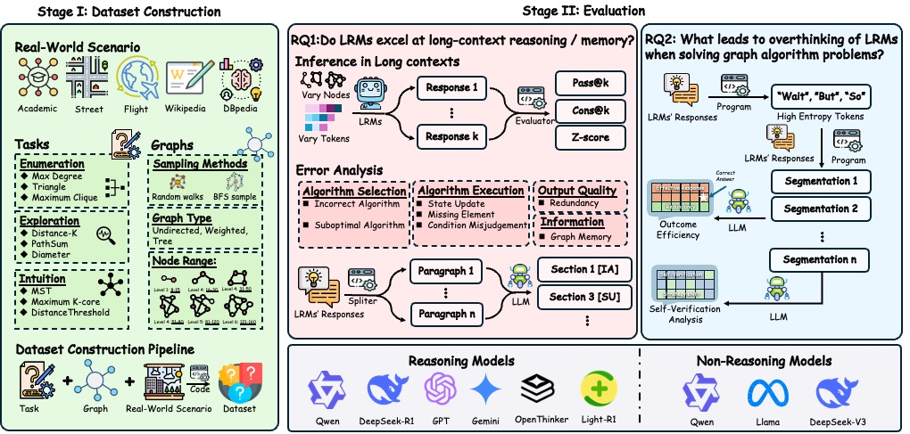

# GrAlgoBench


Large Reasoning Models (LRMs) have achieved rapid progress, yet existing benchmarks—focused on mathematics, programming, or common-sense reasoning—suffer from poor long-context evaluation, weak difficulty control, ambiguous answers, and narrow coverage of reasoning paradigms.
GrAlgoBench introduces a benchmark of graph algorithm problems to evaluate LRMs. Graph tasks naturally provide:
✨ Why GrAlgoBench
•	Effective long-context reasoning → graph descriptions induce long inputs, testing context scalability.
•	Scalable difficulty control → complexity grows smoothly with graph size (8–160 nodes).
•	Standardized evaluation → outputs are integers/nodes/edges, enabling exact and programmatic checking.
•	Diverse reasoning paradigms → tasks span Enumeration, Exploration, and Intuition, mapping to brute-force, search, and greedy paradigms.
📊 Key Findings
Experiments on nine tasks across three categories uncover two major weaknesses of current LRMs:
1.	Performance collapse under long contexts → accuracy drops sharply as graphs or text length grow, due to step-by-step execution errors, weak memory, and redundant reasoning.
2.	Ineffective self-verification → models often engage in verbose self-checking that inflates reasoning traces but rarely improves correctness, becoming the main driver of over-thinking.
🚀 Takeaway
By addressing the shortcomings of prior benchmarks, GrAlgoBench establishes graph algorithm problems as a rigorous, multidimensional, and application-relevant testbed for advancing the study of reasoning in LRMs.


<p align="center">



</p>


## 📂 Project Structure

```
GrAlgoBench/
├── data_generation/        # Scripts for dataset construction
├── Inference/              # Model inference scripts and configs
├── error_analysis/         # Scripts for analyzing model errors
├── overthinking/           # Overthinking analysis module
├── label/                  # Response labeling and segmentation
├── judge/                  # Segment effectiveness judgment
├── entropy_analysis/       # Token entropy analysis and wordclouds
├── logs/                   # Default log directory
├── results/                # Saved inference results
├── scripts/                # Helper bash scripts for batch running
├── common_utils.py         # Shared utilities and configurations
└── README.md               # Documentation
```

---

## 🚀 Quick Start

### 1. Environment Setup
```bash
conda create -n gralgobench python=3.10
conda activate gralgobench
pip install -r requirements.txt
```

### 2. Data Generation
```
python ./data_generation/build_dataset.py
```

Datasets are organized as:
```
dataset/
├── MKC_easy.pkl
├── MKC_medium.pkl
├── MST_hard.pkl
└── ...
```

### 3. Run Inference
Single-task example:
```bash
python Inference/infer_open.py \
    --LLM Qwen3-8B \
    --task MST \
    --difficulty medium \
    --batch_size 32 \
    --gpu_num 4
```

Batch execution via script:
```bash
bash scripts/infer_open.sh
```


### 4. 🔍 Error Analysis

To analyze model errors, follow these steps:

1. **Reformat raw responses**  
   This step parses and normalizes model outputs into a consistent structure:  

   ```bash
   python error_analysis/reformat.py
   ```

2. **Run the error analysis script**  
   Specify the task, evaluation model, and the model that generated the responses:  

   ```bash
   python error_analysis/error_analysis.py \
       --task MST \
       --llm gpt5_mini \
       --response_generated_from_what_model Qwen3-8B
   ```

---

## 🔬 Advanced Analysis Tools

GrAlgoBench provides comprehensive analysis tools to understand model behavior and reasoning patterns across multiple dimensions:

### 5. 🧠 Overthinking Analysis

Analyze model self-verification and reasoning redundancy patterns:

```bash
./overthinking/run_overthinking.sh 0,1 \
    --LLM Qwen3-32B \
    --task_type graph \
    --batch_size 32

./overthinking/run_overthinking.sh 0,1 \
    --LLM Qwen3-32B \
    --task_type math_competition \
    --batch_size 16
```

### 6. 🏷️ Response Labeling

Segment and label model reasoning steps for fine-grained analysis:

```bash
./label/run_label.sh 0,1 \
    --LLM Qwen3-32B \
    --task_type graph \
    --batch_size 32

./label/run_label.sh 0,1 \
    --LLM Qwen3-32B \
    --task_type math_competition \
    --batch_size 16
```

### 7. ⚖️ Segment Judgment

Evaluate the effectiveness of individual reasoning segments:

```bash
./judge/run_judge.sh 0,1 \
    --LLM Qwen3-32B \
    --task_type graph \
    --batch_size 32

./judge/run_judge.sh 0,1 \
    --LLM Qwen3-32B \
    --task_type math \
    --batch_size 16
```

### 8. 📊 Entropy Analysis

Analyze token-level uncertainty and model confidence patterns:

```bash
./entropy_analysis/run_entropy_analysis.sh infer 0,1 \
    --LLM Qwen3-32B --task MaxDegree --difficulty easy

./entropy_analysis/run_entropy_analysis.sh analyze 0,1 \
    --min_freq 40000 --top_k 100

./entropy_analysis/run_entropy_analysis.sh wordcloud 0,1
```


